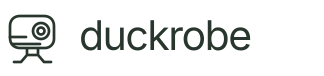

<p align="center"></p>


A playful 3D wardrobe for the real, single-eyed **Microduck**. Explore **100 curated looks**, mix **190 individual pieces**, and meet a little robot with **16 expressive moves**.

**[Open the wardrobe →](https://ruziniuuuuu.github.io/DuckRobe/)**

## Dress up and play

- **A palette for every look.** Complete outfits apply coordinated shell and accent colors. Lock your favorite body colors while trying other outfits; changing an individual piece keeps your colors.
- **A real little wardrobe.** Mix hats, single-frame eyewear, clothes, accessories and legwear. Chest, side and back accessories coexist; replacing one position leaves the other two in place. Remove any piece with its Wearing now chip.
- **Clothes that fit Microduck.** Smooth tilted hats have fitted inner linings. Garments have distinct cuts, closures, hems and details, with accessories positioned against the selected clothes. Ten collections cover everyday dressing, travel, workwear, sport, celebrations and a little fantasy.
- **A lively companion.** Hop, dance, twirl, greet, peek, tilt, nod, sway, take tiny steps, double-hop, shimmy, tap a toe, bow and look around. Calm observation and rest complete the 16-move library. Idle play, mouse curiosity and manual controls share the same real robot joints.
- **Comfortable browsing.** On desktop, the catalog scrolls independently with a wheel, trackpad, keyboard or mouse drag, keeping the duck and filters visible. Mobile uses natural page scrolling. Previews load as you browse.
- **Make it yours.** English by default, with a Chinese switch. Search, favorites, color lock and saved combinations stay in your browser. Existing saved looks migrate to the new accessory positions.
- **Take your duck with you.** Download a ZIP with **URDF + MJCF**, all original robot meshes, current clothing meshes, body colors, source versions and licenses.

The complete design ledger is in [docs/wardrobe.md](docs/wardrobe.md). New looks use distinct garment and accessory combinations; recoloring an identical outfit does not establish a new design.

Exports preserve the native robot's dynamics. Clothing is decorative geometry rather than simulated cloth or manufacturing specifications. Attachment transforms, format details and validation are documented in [docs/export.md](docs/export.md).

## Run locally

Requires Node.js 20.19+ or 22.12+; CI uses Node.js 24.

```bash
npm install
npm run dev
```

Open the address printed in your terminal. Robot assets are bundled locally.

```bash
npm run build
npm run preview
```

## GitHub Pages

[Deploy to GitHub Pages](https://github.com/ruziniuuuuu/DuckRobe/actions/workflows/deploy-pages.yml) checks catalog geometry, hat and eyewear fit, robot behavior, every outfit export and asset loading before building. Pushes to `main` deploy automatically; pull requests run validation and build. The repository's Pages source is **GitHub Actions**.

The build reads the Pages base path for both the interface and robot/export assets. To preview the project path locally:

```bash
VITE_BASE_PATH=/DuckRobe/ npm run build
VITE_BASE_PATH=/DuckRobe/ npm run preview
```

Open the preview server's `/DuckRobe/` URL.

## Verify

```bash
node scripts/validate-catalog.mjs
node scripts/validate-behavior.mjs
npm run check:exports
node scripts/validate-subpath-assets.mjs
```

Catalog checks fingerprint actual geometry without names or colors. Behavior checks exercise all 16 actions, native joint limits, shoe contact, pointer responses and immutable export metadata. Export checks build 100 complete outfits plus mixtures, regional removals, legacy selections, colors and the bare robot. The strict asset server tests both `/` and `/DuckRobe/` paths. Real MuJoCo compilation and dynamics comparisons are described in [docs/export.md](docs/export.md).

Start a local server, then run `npm run check:ui`. Fresh Chromium exercises English and Chinese, palette locks, multi-accessory mixing, saving, animation, scrolling and dragging, responsive layouts and a real ZIP download. Set `DUCKROBE_URL` to test another address.

```bash
node scripts/validate-hat-fit.mjs
node scripts/validate-eyewear-fit.mjs
```

The fit checks use actual native head triangles in closed- and open-beak poses, checking all 38 hats and 19 single-eye frames for intersections and clearance.

## Project map

- `src/outfits.js`: collections, items, canonical selections and shared fit adjustments.
- `src/garment-geometry.js`, `src/accessory-geometry.js`, `src/garment-primitives.js`: clothing geometry and shared construction tools.
- `src/robot.js`: official geometry, native joints, clothing anchors and body colors.
- `src/behavior.js`: idle, manual and pointer-driven joint poses.
- `src/main.js`, `src/i18n.js`: wardrobe controls, saved looks and bilingual copy.
- `src/preview.js`: live fitting room and separate product photography.
- `src/export.js`: URDF/MJCF and mesh packaging.
- `public/brand/`: promotional cover, scalable logo and single-eye brand mark. See [brand notes and generation prompt](docs/brand.md).
- `public/robot/manifest.json`: pinned upstream versions and asset hashes.

## Sources

Robot assets come from [Pollen Robotics Microduck RL](https://github.com/pollen-robotics/microduck_rl), with the [official web simulator](https://huggingface.co/spaces/pollen-robotics/microduck-simulator) as a reference. Exact asset scope and licensing are recorded in [THIRD_PARTY_NOTICES.md](THIRD_PARTY_NOTICES.md).
